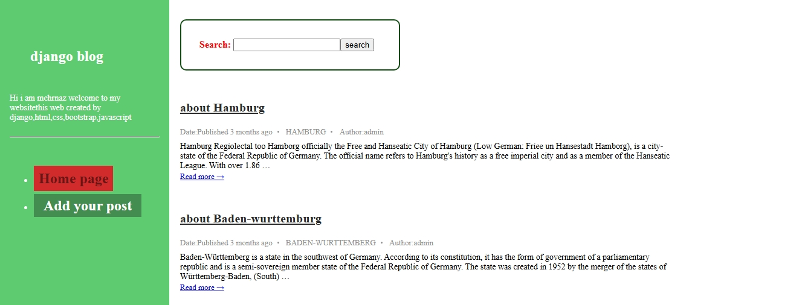
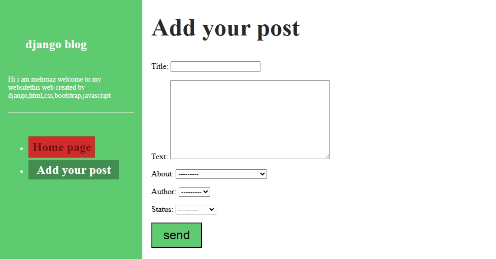
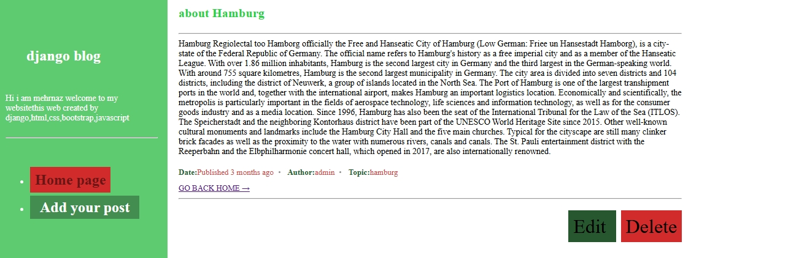

German States Blog
Dieses Projekt ist ein einfacher Blog über die Bundesländer Deutschlands.

Benutzer können Beiträge hinzufügen, bearbeiten, löschen und im Blog suchen.

Funktionen:
Beiträge erstellen, bearbeiten und löschen
Suche nach Beiträgen (Titel und Inhalt)
Anzeige der Beiträge nach Datum (neueste zuerst)
Keine Benutzerregistrierung oder Anmeldung erforderlich
Einfaches und klares Design
Verwendete Technologien:
Python und Django
HTML und CSS
SQLite als Datenbank
Bootstrap für das Layout

